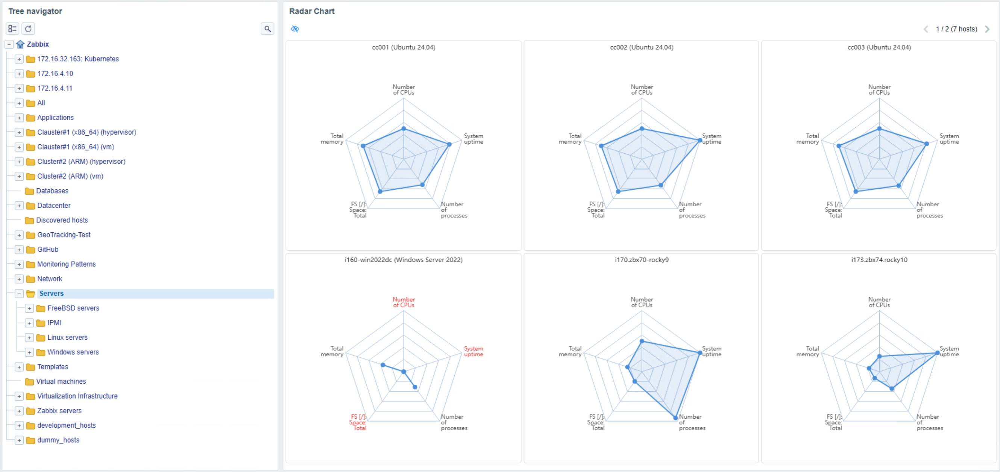
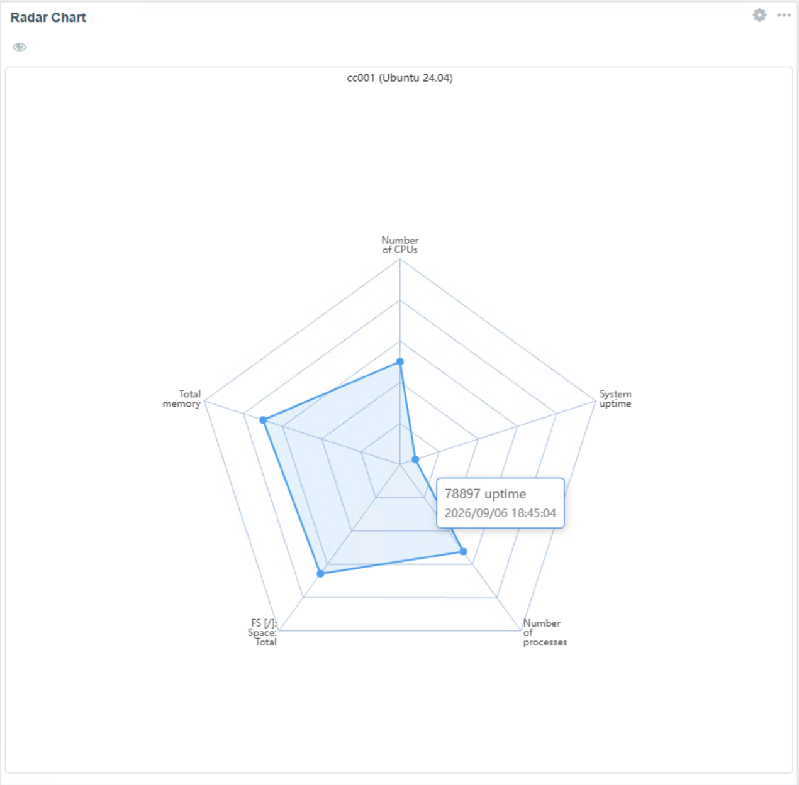
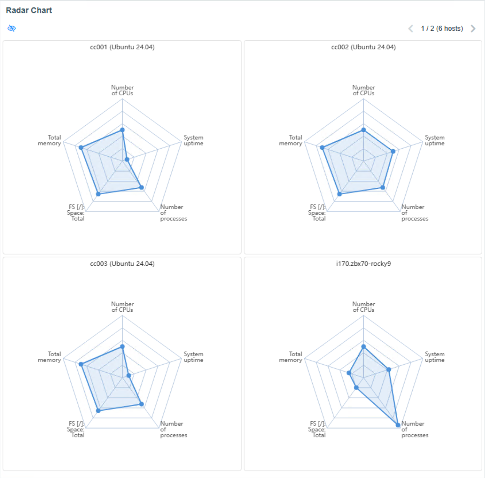
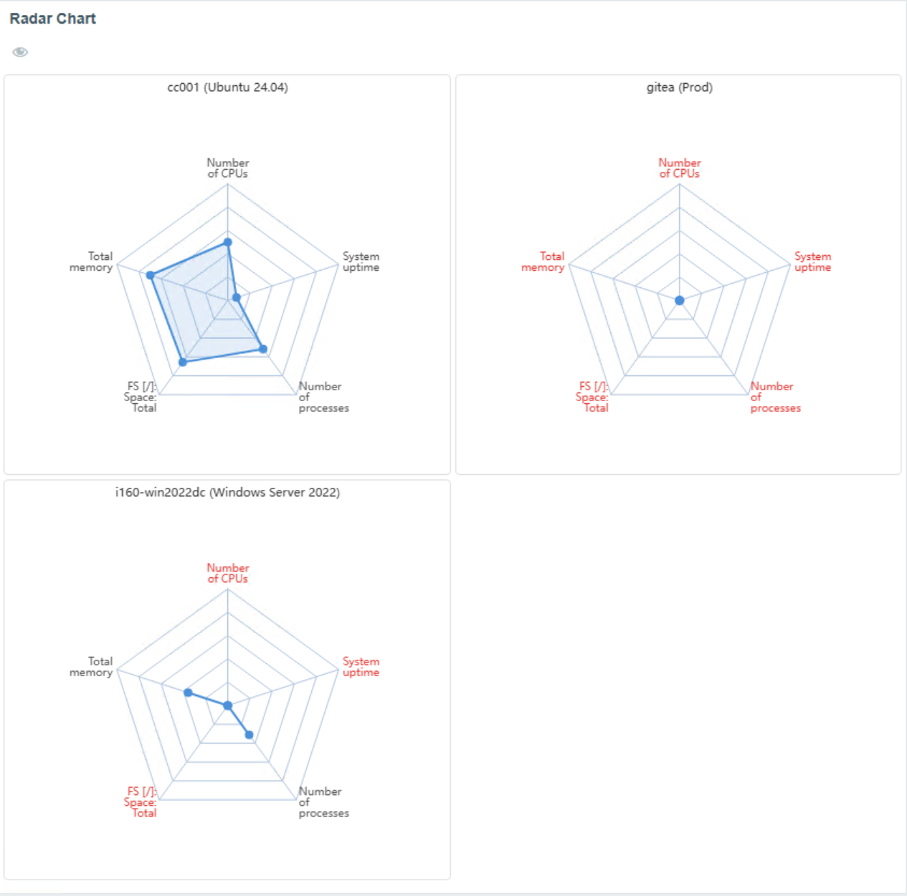
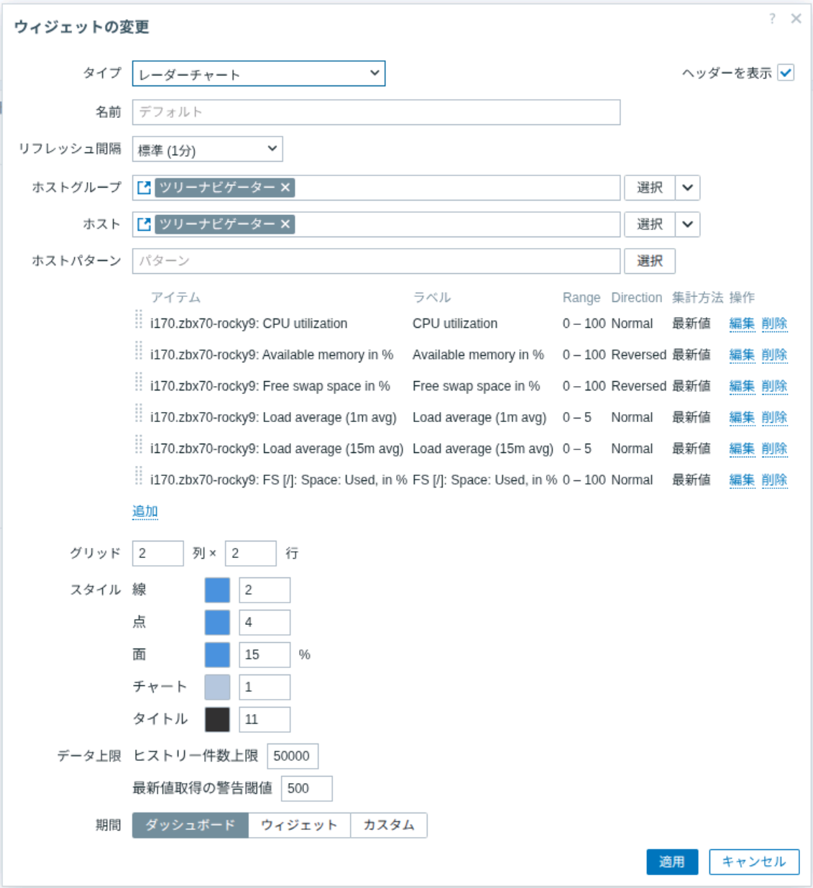
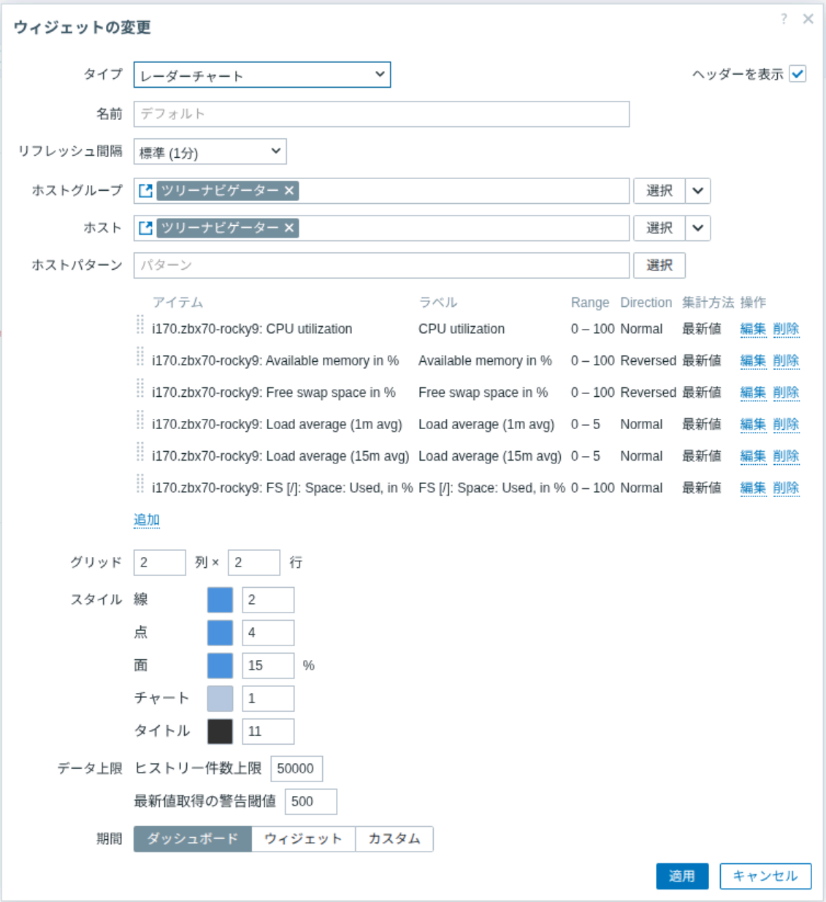
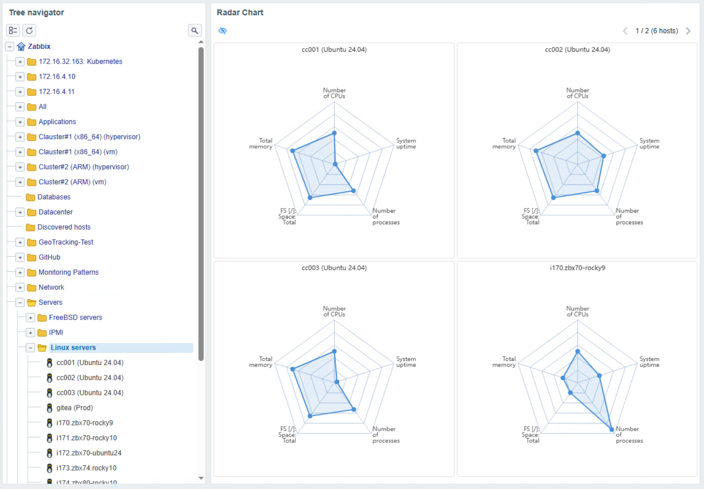

# zabbix-widget-radar-chart

[English](README.md) | 日本語

## 概要

Radar Chart は、複数ホストの数値アイテムをレーダーチャートで比較する Zabbix ダッシュボードウィジェットです。3〜8 個のアイテムを軸として表示し、Tree Navigator、Topology Navigator、または互換ウィジェットからホストグループ・ホストのコンテキストを受け取れます。

<a href="screenshots/radar-chart-dashboard-navigator-integration.png" target="_blank"></a>

[最新リリース](http://172.16.4.190:3000/zabbix-widgets/zabbix-widget-radar-chart/releases/tag/v1.0.10) | [RPM](http://172.16.4.190:3000/zabbix-widgets/zabbix-widget-radar-chart/releases/download/v1.0.10/zabbix-widget-radar-chart-1.0.10.noarch.rpm) | [DEB](http://172.16.4.190:3000/zabbix-widgets/zabbix-widget-radar-chart/releases/download/v1.0.10/zabbix-widget-radar-chart_1.0.10_all.deb) | [ソース](http://172.16.4.190:3000/zabbix-widgets/zabbix-widget-radar-chart/archive/v1.0.10.tar.gz)

## Radar Chart を使う理由

CPU、メモリ、ストレージ、遅延などの値は、共通のスケールで比較するとホストごとの偏りや外れ値を把握しやすくなります。Radar Chart は設定した範囲に値を正規化し、複数ホストの状態をコンパクトに比較できます。

ツールチップでは収集した実値、単位、時刻を確認できるため、概況の比較と初期調査を同じダッシュボードで行えます。

## 機能

<table>
  <tr><th align="left" nowrap>機能</th><th align="left">説明</th></tr>
  <tr><td nowrap>複数ホストのグリッド表示</td><td>最大 6 × 6 のグリッドにホストごとのレーダーチャートを表示します。ページを切り替えてもセルサイズは固定です。</td></tr>
  <tr><td nowrap>ホスト指定</td><td>ホストグループ、個別ホスト、ワイルドカードを使ったホストパターンを指定できます。ホストグループとパターンを併用した場合、パターンはそのグループ内に限定されます。</td></tr>
  <tr><td nowrap>ウィジェット連携</td><td>Tree Navigator、Topology Navigator、または互換ウィジェットからホストグループ・ホストを受け取れます。</td></tr>
  <tr><td nowrap>アイテムごとの集計</td><td>最新値、最大値、最小値、平均値を選択できます。最大値・最小値・平均値は 2 時間未満では History を使い、それより長い期間では Trend を優先し、必要に応じて History にフォールバックします。</td></tr>
  <tr><td nowrap>アイテムごとのスケール</td><td>最小値・最大値で値を正規化します。負数レンジと軸方向の反転に対応しています。</td></tr>
  <tr><td nowrap>運用時のフィードバック</td><td>詳細ツールチップ、データ欠損表示、全欠損ホストの非表示、ページング、集計警告を提供します。</td></tr>
</table>

<table>
  <tr>
    <td align="center" valign="top" width="33%">
      <strong>単一表示</strong><br>
      <a href="screenshots/radar-chart-tooltip.png" target="_blank"></a>
    </td>
    <td align="center" valign="top" width="33%">
      <strong>複数表示</strong><br>
      <a href="screenshots/radar-chart-dashboard-multiple.png" target="_blank"></a>
    </td>
    <td align="center" valign="top" width="33%">
      <strong>表示パターン</strong><br>
      <a href="screenshots/radar-chart-missing-data-pagination.png" target="_blank"></a>
    </td>
  </tr>
</table>

## 設定項目

| 項目 | 説明 |
| --- | --- |
| ホストグループ | 対象ホストグループを選択します。 |
| ホスト | 対象ホストを選択します。 |
| ホストパターン | ワイルドカードでホスト名を絞り込みます。 |
| アイテム | 数値アイテムを 3〜8 個追加します。 |
| アイテム：アイテム | 軸に使う数値アイテムを選択します。 |
| アイテム：ラベル | 軸のラベルを設定します。 |
| アイテム：範囲（最小値 / 最大値） | 正規化の範囲を設定します。 |
| アイテム：軸方向 | 通常または反転を選択します。 |
| アイテム：集計方法 | 最新値、最大値、最小値、平均値を選択します。 |
| グリッド | 列数と行数を 1〜6 で設定します。 |
| スタイル：線 | 色と太さを設定します。 |
| スタイル：点 | 色と大きさを設定します。 |
| スタイル：塗りつぶし | 色と不透明度を設定します。 |
| スタイル：チャート | 色と線の太さを設定します。 |
| スタイル：タイトル | 色とサイズを設定します。 |
| データ上限：History 行数 | 1,000〜1,000,000（既定 50,000）で設定します。 |
| データ上限：Latest 取得警告 | 10〜100,000（既定 500）で設定します。 |
| 期間 | 集計期間を設定します。 |

ウィジェット設定では、対象範囲、アイテム、レイアウト、表示スタイルを選択します。

<a href="screenshots/radar-chart-settings-ja.png" target="_blank"></a>

アイテムごとに最小値・最大値、軸方向、集計方法を設定します。最小値は最大値より小さくする必要があります。軸を反転しても変わるのはチャート上の位置だけで、ツールチップには取得した実値を表示します。

<a href="screenshots/radar-chart-item-settings-ja.png" target="_blank"></a>

## 動作

ホストグループまたはホストを選択するナビゲーターと Radar Chart を同じダッシュボードページに追加し、Radar Chart の Host groups および Hosts 入力を連携元のウィジェットに接続します。ナビゲーターでグループまたはホストを選択すると、チャートの対象範囲が更新されます。

値はダッシュボードの期間に対して計算されます。Latest はその期間内で最も新しい History 値を使います。Max、Min、Avg は短い期間では History を使い、長い期間では Trend を優先します。値を取得できない軸は欠損として表示され、すべての値が欠損のホストは非表示にできます。ホスト数がグリッドのセル数を超える場合はページングを表示します。

<a href="screenshots/radar-chart-navigator-integration.png" target="_blank"></a>

## 動作要件

- Zabbix 7.0 以上
- PHP 8.1 以上
- RPM パッケージは Rocky Linux 9 または 10 を対象とします。互換する PHP と Zabbix パッケージがあれば、他の RHEL 互換ディストリビューションでも動作が見込まれます
- Zabbix フロントエンドがサポートするブラウザ

## インストール

### RPM パッケージ

```bash
dnf install ./zabbix-widget-radar-chart-<version>.noarch.rpm
```

RPM は PHP または php-common と php-fpm の 8.1 以上を必要とします。

### DEB パッケージ

```bash
apt install ./zabbix-widget-radar-chart_<version>_all.deb
```

Debian パッケージは PHP 8.1 以上を必要とします。

### ソースからのインストール

モジュールをフロントエンドのモジュールディレクトリへコピーし、**管理 → モジュール** でスキャンして有効化します。

```bash
# Zabbix 7.x
cp -r zabbix-widget-radar-chart /usr/share/zabbix/modules/holoztek_radar_chart

# Zabbix 8.x
cp -r zabbix-widget-radar-chart /usr/share/zabbix/ui/modules/holoztek_radar_chart
```

v1.0.0 以前から更新する場合は、モジュール ID が `radar-chart` から `holoztek_radar_chart` に変わります。所有元を確認してから旧モジュールを停止し、新しいモジュールを再スキャン・有効化したうえで、既存のダッシュボードウィジェット type を新 ID に更新してください。既存の設定フィールドと参照は保持されます。

## ドキュメント

- [パッケージ変更履歴](debian/changelog)
- [バージョン整合性チェック](scripts/check-version-consistency.sh)
- [正規化テスト](scripts/test-normalization.js)
- [サードパーティー通知](THIRD_PARTY_NOTICES.md)

## 構成

- 実行モジュール: リポジトリ直下、`actions/`、`assets/`、`includes/`、`locale/`、`views/`
- パッケージング: `packaging/rpm/`、`debian/`
- スクリーンショット: `screenshots/`
- チェック・テスト: `scripts/`

## 同梱依存ライブラリ

`assets/js/echarts.min.js` は Apache ECharts 6.1.0（ZRenderを含む）のminified buildです。
Apache License 2.0 の条件に基づいて配布されています。詳細は [NOTICE](NOTICE) と [THIRD_PARTY_NOTICES.md](THIRD_PARTY_NOTICES.md) を参照してください。

## メンテナ

HOLOZTEK が開発・保守しています。

## ライセンス

本プロジェクトは [MIT License](LICENSE) の下で提供されています。
