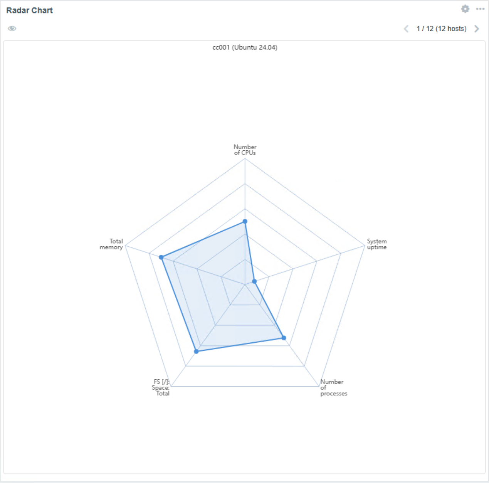
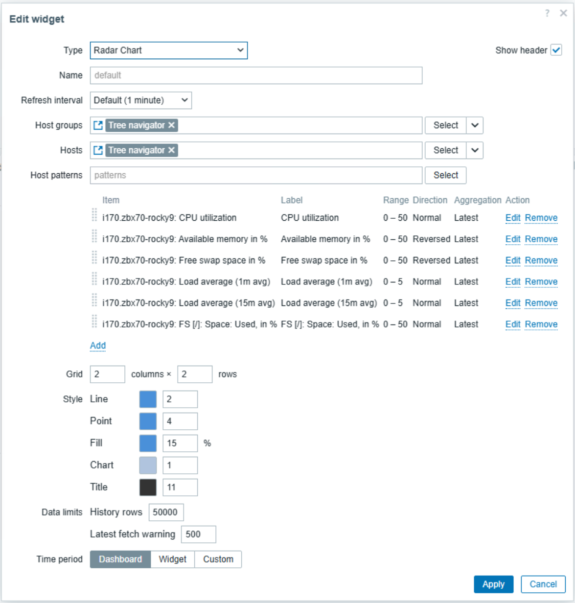
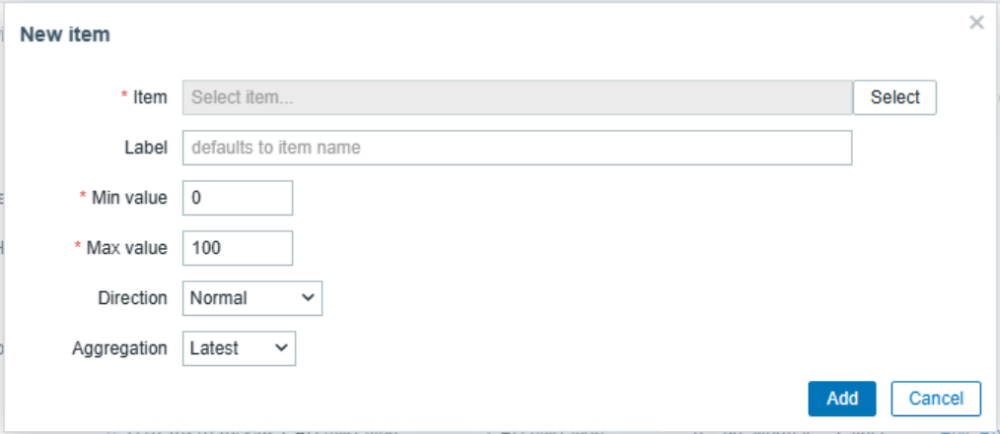

# zabbix-widget-radar-chart

English | [日本語](README.ja.md)

## Overview

Radar Chart is a Zabbix dashboard widget for comparing numeric item values across one or many hosts. It renders three to eight selected metrics as a radar chart for each host and can receive host-group context from Tree Navigator, Topology Navigator, or another compatible widget.

<a href="screenshots/radar-chart-dashboard-multiple.png" target="_blank"></a>

## Why Radar Chart?

CPU, memory, storage, latency, and other metrics are easier to compare when they share a common visual scale. Radar Chart normalizes selected values against their configured ranges, making imbalances and outliers apparent across hosts.

Tooltips retain the collected values, units, and timestamps, so a dashboard can support both an at-a-glance comparison and an initial investigation.

## Features

<table>
  <tr><th align="left" nowrap>Function</th><th align="left">Description</th></tr>
  <tr><td nowrap>Multi-host grid</td><td>Displays up to a 6 × 6 grid of host radar charts with stable cell sizes across pages.</td></tr>
  <tr><td nowrap>Host selection</td><td>Selects hosts by host group, individual host, or wildcard host pattern. A host group scopes the pattern when both are configured.</td></tr>
  <tr><td nowrap>Widget integration</td><td>Receives host groups and hosts from Tree Navigator, Topology Navigator, or another compatible widget.</td></tr>
  <tr><td nowrap>Per-item aggregation</td><td>Uses Latest, Max, Min, or Avg. Max, Min, and Avg use History for periods under two hours and prefer Trends for longer periods, with a History fallback.</td></tr>
  <tr><td nowrap>Per-item scale</td><td>Normalizes each value against its configured minimum and maximum. Negative ranges and reversed axes are supported.</td></tr>
  <tr><td nowrap>Operational feedback</td><td>Shows detailed tooltips, missing-data labels, all-missing host filtering, pagination, and aggregation warnings.</td></tr>
</table>

<table>
  <tr>
    <td align="center" valign="top" width="33%">
      <strong>Single-host detail</strong><br>
      <a href="screenshots/radar-chart-dashboard-single.png" target="_blank"></a>
    </td>
    <td align="center" valign="top" width="33%">
      <strong>Value details</strong><br>
      <a href="screenshots/radar-chart-tooltip.png" target="_blank"></a>
    </td>
    <td align="center" valign="top" width="33%">
      <strong>Missing data and pages</strong><br>
      <a href="screenshots/radar-chart-missing-data-pagination.png" target="_blank"></a>
    </td>
  </tr>
</table>

## Settings

<table>
  <tr><th align="left" nowrap>Setting</th><th align="left">Description</th></tr>
  <tr><td nowrap>Host groups / Hosts / Host patterns</td><td>Choose target hosts directly or receive them from another widget.</td></tr>
  <tr><td nowrap>Items</td><td>Configure three to eight numeric items. Each item has a label, minimum, maximum, direction, and aggregation method.</td></tr>
  <tr><td nowrap>Grid</td><td>Set the number of columns and rows from 1 to 6.</td></tr>
  <tr><td nowrap>Style</td><td>Control line, point, fill, chart, and title colors and sizes.</td></tr>
  <tr><td nowrap>Data limits</td><td>Set the History row limit and the warning threshold for Latest fetches.</td></tr>
  <tr><td nowrap>Time period</td><td>Use the dashboard time period for aggregation.</td></tr>
</table>

The widget settings select the scope, items, layout, and appearance.

<a href="screenshots/radar-chart-settings-en.png" target="_blank"></a>

For every item, set the minimum and maximum values, axis direction, and aggregation method. A minimum must be lower than its maximum; reversing an axis changes only the plotted position, not the collected value shown in the tooltip.

<a href="screenshots/radar-chart-item-settings-en.png" target="_blank"></a>

## Behavior

Add a host-group or host navigator and Radar Chart to the same dashboard page, then connect the Radar Chart host-group and/or host input to the source widget. Selecting a group or host updates the chart scope.

Values are calculated for the dashboard time period. Latest uses the most recent History value within that period; Max, Min, and Avg use History for short periods and prefer Trends for longer periods. When data is unavailable, the axis is marked as missing. Hosts with no available values can be hidden, and grids with more hosts than cells provide pagination.

<a href="screenshots/radar-chart-navigator-integration.png" target="_blank"></a>

## Requirements

- Zabbix 7.0 or later
- PHP 8.1 or later
- Rocky Linux 9 or 10 for the RPM package; other RHEL-compatible distributions are expected to work with compatible PHP and Zabbix packages
- A browser supported by the Zabbix frontend

## Installation

### RPM package

```bash
dnf install ./zabbix-widget-radar-chart-<version>.noarch.rpm
```

The RPM requires PHP or php-common, and php-fpm, version 8.1 or later.

### DEB package

```bash
apt install ./zabbix-widget-radar-chart_<version>_all.deb
```

The Debian package requires PHP 8.1 or later.

### From source

Copy the module into the frontend module directory, then scan and enable it from **Administration → Modules**.

```bash
# Zabbix 7.x
cp -r zabbix-widget-radar-chart /usr/share/zabbix/modules/holoztek_radar_chart

# Zabbix 8.x
cp -r zabbix-widget-radar-chart /usr/share/zabbix/ui/modules/holoztek_radar_chart
```

When upgrading from v1.0.0 or earlier, the module ID changes from `radar-chart` to `holoztek_radar_chart`. Rescan and enable the new module, retire the old module after verifying its ownership, and update existing dashboard widget types to the new ID. Existing field settings and references are preserved.

## Documentation

- [Package changelog](debian/changelog)
- [Version consistency check](scripts/check-version-consistency.sh)
- [Normalization tests](scripts/test-normalization.js)
- [Third-party notices](THIRD_PARTY_NOTICES.md)

## Repository Layout

- Runtime module: repository root, `actions/`, `assets/`, `includes/`, `locale/`, and `views/`
- Packaging: `packaging/rpm/` and `debian/`
- Screenshots: `screenshots/`
- Checks and tests: `scripts/`

## Maintainer

Developed and maintained by HOLOZTEK.

## License

This project is licensed under the MIT License. See [LICENSE](LICENSE). It bundles Apache ECharts under the Apache License 2.0; see [NOTICE](NOTICE) and [THIRD_PARTY_NOTICES.md](THIRD_PARTY_NOTICES.md).
